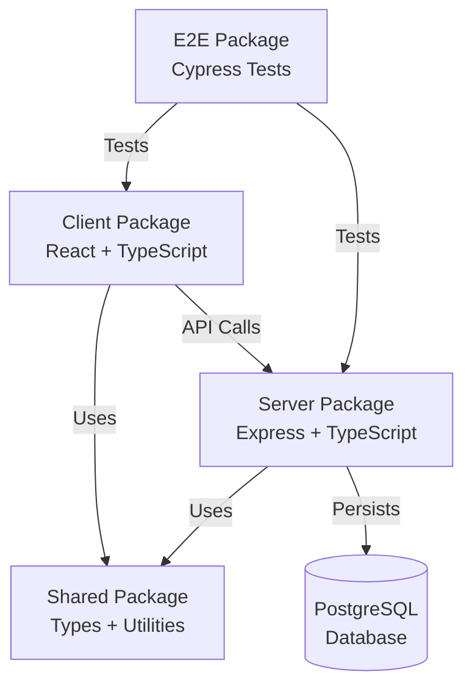
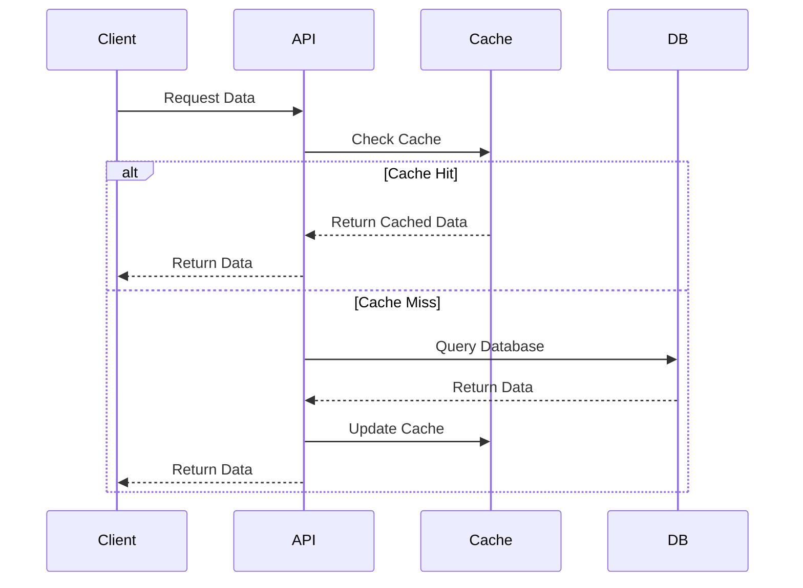
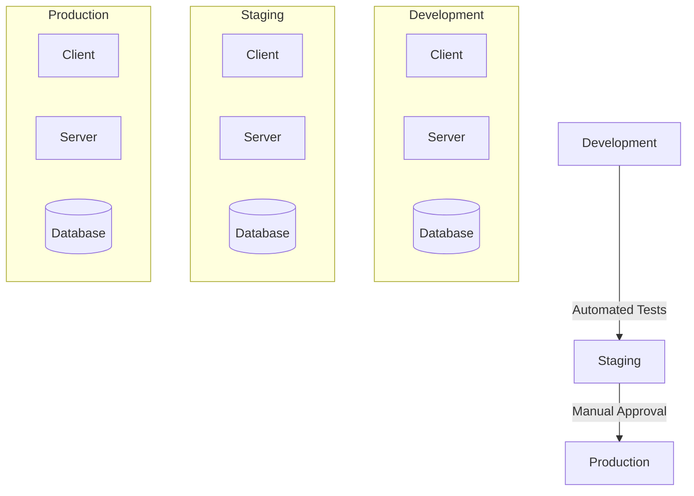

# Architecture Documentation

## System Overview

The Recipe Manager SPA is built as a modern, scalable monorepo using TypeScript throughout the stack.

## Technology Stack

### Frontend (packages/client)
- **Framework**: React 18
- **Build Tool**: Vite
- **State Management**: React Query + Context
- **UI Framework**: Material-UI
- **Form Management**: React Hook Form
- **Testing**: Jest + React Testing Library

### Backend (packages/server)
- **Framework**: Express.js
- **Database ORM**: Prisma
- **Database**: PostgreSQL
- **Authentication**: JWT
- **API Documentation**: OpenAPI/Swagger
- **Testing**: Jest + Supertest

### Shared (packages/shared)
- **Language**: TypeScript
- **Utilities**: Common functions
- **Types**: Shared type definitions
- **Constants**: Shared constants

### E2E Testing (packages/e2e)
- **Framework**: Cypress
- **Assertions**: Chai
- **Coverage**: Istanbul

## Data Flow

## Security Architecture

1. **Authentication Flow**
   - JWT-based authentication
   - Refresh token rotation
   - Secure cookie storage
   - CSRF protection

2. **Authorization**
   - Role-based access control
   - Resource-level permissions
   - API route protection
   - Frontend route guards

3. **Data Security**
   - Input validation
   - Output sanitization
   - SQL injection prevention
   - XSS protection

## Performance Optimization

1. **Frontend**
   - Code splitting
   - Route-based chunking
   - Image optimization
   - Service worker caching

2. **Backend**
   - Query optimization
   - Connection pooling
   - Response caching
   - Rate limiting

## Error Handling

1. **Frontend**
   - Error boundaries
   - API error handling
   - Offline support
   - Retry mechanisms

2. **Backend**
   - Global error handler
   - Validation errors
   - Database errors
   - Third-party service errors

## Monitoring and Logging

1. **Application Monitoring**
   - Performance metrics
   - Error tracking
   - User analytics
   - API metrics

2. **Logging Strategy**
   - Request logging
   - Error logging
   - Audit logging
   - Performance logging

## Deployment Architecture

## API Architecture

1. **REST API Design**
   - Resource-based routes
   - Proper HTTP methods
   - Consistent response format
   - Proper status codes

2. **API Versioning**
   - URL-based versioning
   - Version compatibility
   - Deprecation strategy
   - Documentation updates

## Database Architecture

1. **Schema Design**
   - Normalized structure
   - Proper indexing
   - Foreign key constraints
   - Audit fields

2. **Migration Strategy**
   - Version control
   - Rollback support
   - Data preservation
   - Zero-downtime updates

## Testing Strategy

1. **Unit Testing**
   - Component tests
   - Service tests
   - Utility tests
   - High coverage

2. **Integration Testing**
   - API tests
   - Database tests
   - Service integration
   - Authentication flow

3. **E2E Testing**
   - Critical paths
   - User flows
   - Edge cases
   - Performance tests

## Scalability Considerations

1. **Horizontal Scaling**
   - Stateless services
   - Load balancing
   - Session management
   - Cache distribution

2. **Vertical Scaling**
   - Resource optimization
   - Memory management
   - Connection pooling
   - Query optimization