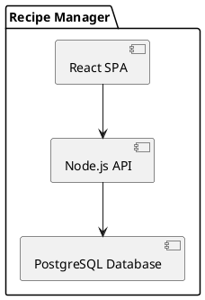

# Architecture

## Component Diagram

## Rationale

The architecture is designed to separate concerns between the frontend and backend, allowing for independent development and scaling. React is used for building a dynamic and responsive user interface, while Node.js and Express handle the server-side logic and API endpoints. PostgreSQL is chosen for its robust relational database capabilities.

## Data Flow

1. **User Interaction**: Users interact with the React frontend to perform actions such as viewing, adding, or editing recipes.
2. **API Requests**: The frontend communicates with the backend via RESTful API requests.
3. **Database Operations**: The backend processes these requests, performing CRUD operations on the PostgreSQL database.
4. **Response Handling**: The backend sends responses back to the frontend, which updates the UI accordingly.
